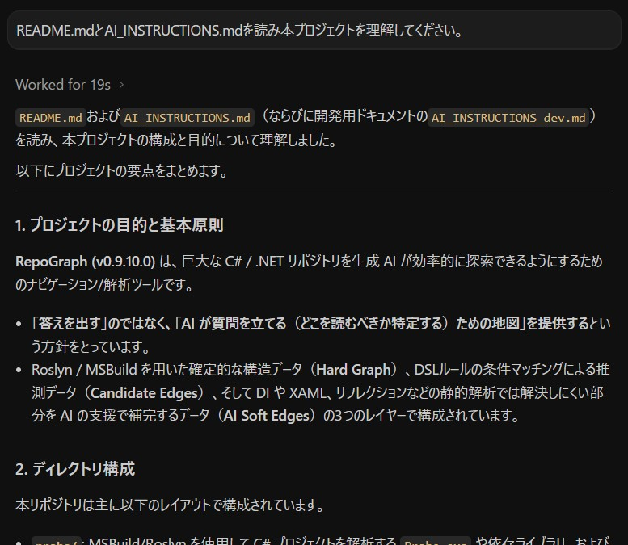
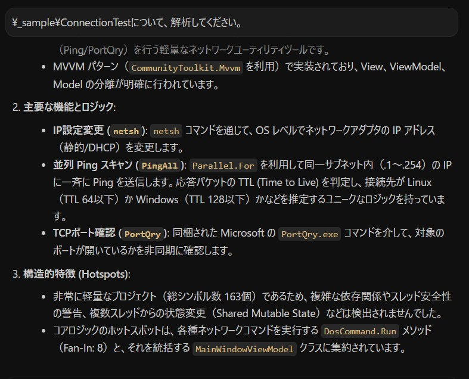

# RoslynGraphAI (v0.9.10.0)

RoslynGraphAI は、巨大な C# / .NET リポジトリを生成 AI が探索しやすくするための解析ツールです。

基本原則:
RoslynGraphAI は「答えを出すツール」ではなく、「AI が質問を立てるためのツール」です。
AI は自分でファイルを読めます。RoslynGraphAI の役割は、巨大リポジトリで AI が迷子にならないための地図を提供することに限定します。

## 何をするツールか

- `Probe` が Roslyn / MSBuild で `.sln` / `.csproj` を解析し、確定的な構造データ（Hard graph）と、DSL ルールによる推測データ（Candidate edges）を出力します。DSL ルールは `probe/rules/dsl/*.json` に配置されます。
- `python-rag` がその出力を使い、`hotspots`、`isolation`、`related`、`ai-candidates` などの調査入口を作ります。
- `ai_soft_edges.json` を別レイヤーのオーバーレイとして扱い、XAML / reflection / DI のような hard graph で取り切れない難所を AI 補助で扱えます。

RoslynGraphAI は、次のような用途に向いています。

- 巨大なレガシーコードの初期把握
- どこから読むべきかの優先順位付け
- shared mutable state や UI / background thread 混在箇所の抽出
- XAML / reflection / DI のような難所の候補化
- AI に raw `grep` 前の地図を渡すこと

## 通常利用時のファイル構成

通常利用では、次のような配置を想定します。

```text
RoslynGraphAI/
  probe/
    Probe.exe
    Probe.dll
    Probe.runtimeconfig.json
    Probe.deps.json
      rules/
        dsl/
    BuildHost-net472/
    BuildHost-netcore/
    runtimes/
    *.dll

  python-rag/
    main.py
    *.py

  analysis_workspace/
  README.md
  AI_INSTRUCTIONS.md
  LICENSE
```

重要:

- `Probe.exe` 単体では足りません。`probe/` 配下の一式が必要です。
- 通常利用は `probe/Probe.exe` 配布レイアウトを前提にします。開発時だけ `roslyn-cli/Probe` と `dotnet build/run` を使います。
- `analysis_workspace/` は解析結果の出力先です。
- `README.md` は人間向け、`AI_INSTRUCTIONS.md` は通常利用時に AI へ見せるための文書です。
- RoslynGraphAI 本体を改造する場合は [AI_INSTRUCTIONS_dev.md](AI_INSTRUCTIONS_dev.md) を参照してください。

## 必要環境

- Python 実行環境
- `probe/` 配下の配布物一式
- 解析対象プロジェクトを Roslyn / MSBuild で解決するための環境

最後の項目は対象リポジトリ次第です。現実には次のいずれかが必要になることがあります。

- .NET SDK
- Visual Studio Build Tools
- .NET Framework Developer Pack / targeting pack
- 対象ソリューション固有の workload

つまり、RoslynGraphAI 本体は zip 配布しやすいですが、対象リポジトリを解析できるかは対象側のビルド環境にも依存します。

## クイックスタート (AI に使わせる場合)

### 1. Release zip の展開

GitHub の Release ページから `RoslynGraphAI-vX.Y.Z.zip` などの最新の配布用 zip ファイルをダウンロードし、任意のディレクトリに展開します。
展開すると、以下のような構成になります。

```text
RoslynGraphAI/
  probe/
  python-rag/
  README.md
  AI_INSTRUCTIONS.md
  ...
```

### 2. Python 依存ライブラリのインストール

`python-rag` を実行するために、いくつかの Python パッケージが必要です。展開したディレクトリで以下のコマンドを実行し、必要なパッケージをインストールしてください。（※ `requirements.txt` が同梱されている場合は `pip install -r requirements.txt` を実行してください）

```powershell
pip install typer pyyaml sqlalchemy loguru
```

### 3. AI への指示

環境の準備ができたら、AI エージェント（Copilot, ChatGPT, Claude など）に以下のように指示を出します。

1. **ドキュメントの読み込み**: 「まず `README.md` と `AI_INSTRUCTIONS.md` を読んでください。」

---
例：



---

2. **目的の共有**: 「〇〇のバグを修正したいです」「××の仕様について調査してください」など、目的を伝えます。

---
例：



---

3. 以降は AI が `AI_INSTRUCTIONS.md` の手順に従い、自律的に `Probe.exe` の実行や `python-rag` による情報収集を行ってくれます。

※ RoslynGraphAI 本体を改造する AI には [AI_INSTRUCTIONS_dev.md](AI_INSTRUCTIONS_dev.md) を使ってください。

## License

[MIT License](LICENSE)
